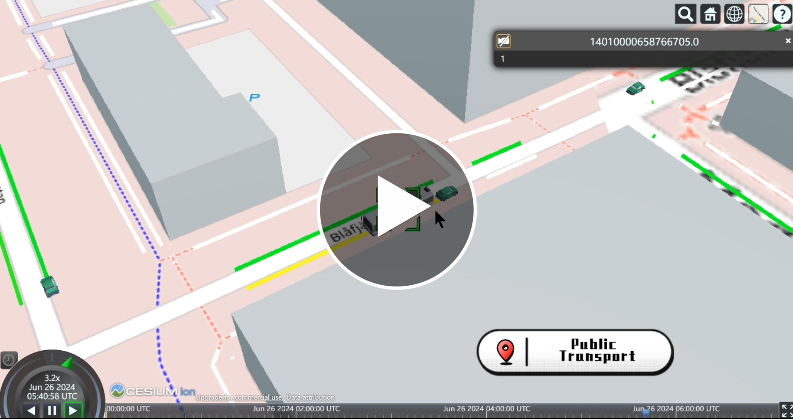

# 🚍 MobilityTwin-PT (OPDTwin)

Despite its practical potential, the current adoptation of Digital Twins (DT) in the transportation domain and especially in Public Transport (PT) is relatively slow. A significant barrier is the substantial effort and investment in resources required during the development phase, especially for informative visualizations, thus limiting its accessibility to PT agencies. 

Thus, we propose an automated development pipeline of DT for PT, which uses open-source software and data that make it easy to access and extend. 

**Demonstration of the PT DT platform:**

## Overview

This is a summary of a tutorial that can help you quickly understand our overall technology pipeline. If you want to get started developing a DT instance for yourself, please refer to our more detailed [documentation](https://mobilityinformaticslab.github.io/opdtwin/).

The goal of our DT development pipeline is building an open-source digital twin model for urban public transportation system. Technically, there are some key issues that need to be addressed.

- How to represent physical objects (road, buildings, land etc.) as the 3D digital twin objects? 
- How to visualize vehicle (buses, trains, etc) movements and corresponding effects such as emissions, congestion, noise, etc.?
- How to integrate the traffic outputs into the digital twin platform?
- How to integrate real-time public transport data
     
**Overview of the development pipeline:**
![[pipeline]](docs/_static/DT-Pipeline-Overview.png)

## Building Data
### Overview
The basic idea is to obtain a three-dimensional model from OSM data. The process begins with downloading building data from Open Street Map. After obtaining the GeoJSON data of the buildings, it needs to be converted into CityGML (3D data).

Subsequently the CityGML data is transformed into 3D Tiles for efficient visualization in the Cesium platform. 

## Vehicle Data
### Overview
While GTFS static provides data about public transport schedules, GTFS real-time provides historical and real-time public transport trajectories. Typically public transport agencies provide APIs to query both types of data if available. In our case, we obtained the data from the Koda API for regional GTFS data in Sweden. 

For analysis and forecasting cases, such as noise/emission/congestion evaluation in alternative planning scenarios, we co-simulate public transport and individual vehicles in SUMO and process the output for visualization in the Cesium platform.

For GTFS Realtime data, we have two main operations. The first focus is on historical GTFS real-time data, which can lay the foundation for many future historical data analyses. The second is the real-time data visualization.

## Digital Twin Platform
### CesiumJS
CesiumJS is the core of our DT visualization platform. We chose this web-based platform because cross platform access is relatively simple, and it also has scalability and flexibility.

We need to visualize the building environment and vehicle trajectories, and Cesium supports both aspects very well:
- For vehicle trajectories, Cesium provides the Cesium Language (CZML), an open data format designed to represent dynamic geospatial objects and their changes over time. CZML is a JSON-based schema and file format that allows the description of time-varying geospatial data and graphical scenes.
- For building environment, CityGML data, derived from OSM building data, serves as the 3D model representation standard due to its extendability and compatibility with other DT pipelines.

### Server Framework
Currently, using Node.js + Express (visualization of simulation results)/ Flask + MongoDB (real-time GTFS data)

